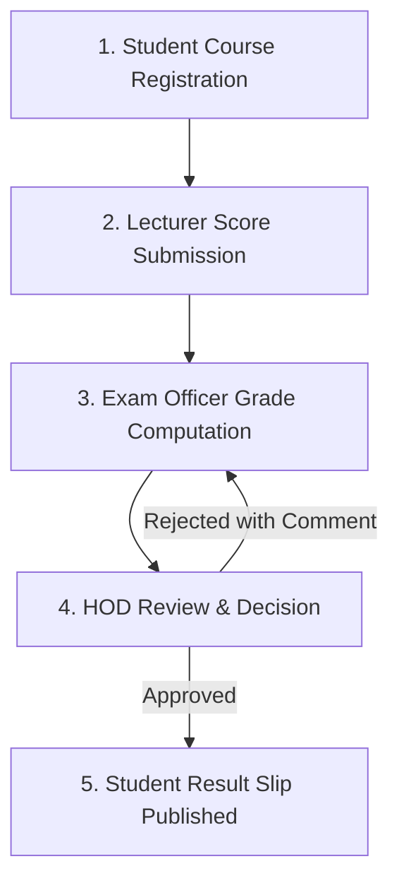

# UNN Student Result Processing System (UNN SRPS)

A web-based university departmental **Student Result Processing System (SRPS)** for the **University of Nigeria, Nsukka (UNN)**, Faculty of Physical Sciences, Department of Computer Science.  
**Motto**: *"To Restore the Dignity of Man"*

Built with **React (Vite) + Vanilla CSS design system** on the frontend, **PHP 8 + PDO prepared statements** on the backend, and **MySQL** database managed via XAMPP.

---

## 🏛️ System Architecture & Workflow Gates

The system enforces a strict sequential academic workflow. Each phase must be completed before the next becomes accessible:



1. **Course Registration**: Students register for departmental courses offered in the active academic session (`2025/2026`) and semester (`First Semester`).
2. **Score Submission**: Lecturers enter and edit CA (0–30) and Exam (0–70) scores strictly for their assigned courses.
3. **Grade Computation**: Exam Officer initiates computation for the session/semester. **Blocked (HTTP 409)** if any registered student has missing scores. Computing calculates grades, GPA, and CGPA, and sets status to `pending` (also resets previously rejected results to `pending`).
4. **HOD Approval**: Head of Department reviews the pending queue. Approvals publish the results. Rejections **require mandatory comments** and return the results to the Exam Officer.
5. **Student Visibility**: Students can view and print official result slips **strictly after HOD approval**. Pending and rejected results are never visible to students.

---

## 🔐 Pre-Seeded Login Credentials

> **Password Note**: The password was **NOT changed** — all pre-seeded accounts continue to use the standard default password: **`Password123`** (hashed using PHP `password_hash($pw, PASSWORD_BCRYPT)`).  
> The **email addresses and matriculation numbers** were updated to match authentic University of Nigeria, Nsukka (`@unn.edu.ng`) identity.

| Role | Staff / Student Name | UNN Academic Email | Password | Details / Assigned Courses |
| :--- | :--- | :--- | :--- | :--- |
| **System Admin** | Engr. Nnamdi A. Eze | `admin@unn.edu.ng` | `Password123` | Department System Administrator |
| **Exam Officer** | Mr. Obinna E. Okeke | `obinna.okeke@unn.edu.ng` | `Password123` | Examination Officer Console |
| **Head of Dept (HOD)** | Prof. Charles O. Ugwu | `charles.ugwu@unn.edu.ng` | `Password123` | Head of Department Approval Desk |
| **Lecturer 1** | Dr. Chidinma O. Ani | `chidinma.ani@unn.edu.ng` | `Password123` | `CSC 301` (Algorithms), `CSC 305` (Database) |
| **Lecturer 2** | Dr. Kingsley C. Nnaji | `kingsley.nnaji@unn.edu.ng` | `Password123` | `CSC 303` (OS), `CSC 307` (Software Eng.) |
| **Student 1** | Chukwuma Okonkwo | `chukwuma.okonkwo@unn.edu.ng` | `Password123` | Matric: **`2021/245101`** (300 Level) |
| **Student 2** | Ngozi Eze | `ngozi.eze@unn.edu.ng` | `Password123` | Matric: **`2021/245102`** (300 Level) |
| **Student 3** | Emmanuel Nnamani | `emmanuel.nnamani@unn.edu.ng` | `Password123` | Matric: **`2021/245103`** (300 Level) |
| **Student 4** | Chioma Adeleke | `chioma.adeleke@unn.edu.ng` | `Password123` | Matric: **`2021/245104`** (300 Level) |
| **Student 5** | Babatunde Okafor | `babatunde.okafor@unn.edu.ng` | `Password123` | Matric: **`2021/245105`** (300 Level) |

---

## 💻 Tech Stack

- **Frontend**: React 18, Vite, Bootstrap 5.3, Bootstrap Icons
  - Served at: `http://localhost:5173`
  - Authentication: Session cookies via `credentials: "include"`
- **Backend**: Plain PHP 8 (No framework), PDO Prepared Statements, Native PHP Sessions
  - Served at: `http://localhost/srps/api`
  - CORS: Configured for `http://localhost:5173` with credentials support
- **Database**: MySQL (`srps_db`)
  - Managed through XAMPP phpMyAdmin / MySQL CLI

---

## ⚙️ Exact Setup Instructions for Windows (XAMPP)

### Step 1: Start XAMPP Services
1. Open the **XAMPP Control Panel**.
2. Start the **Apache** and **MySQL** modules.

### Step 2: Deploy Backend to XAMPP Apache
Copy the `api` folder into your XAMPP web root:
- Destination: `C:\xampp\htdocs\srps\api`

Alternatively, create a directory junction in PowerShell (so updates in this workspace sync live):
```powershell
New-Item -ItemType Junction -Path "C:\xampp\htdocs\srps" -Target "C:\Users\Dell\Desktop\BSC imp"
```
Verify backend connectivity by opening: [http://localhost/srps/api/auth/me.php](http://localhost/srps/api/auth/me.php) (Returns `{"error":"Not authenticated"}` with HTTP 401).

### Step 3: Import or Reset the Database
To import for the first time or reset to clean, fresh UNN seed data:

**Command Prompt (`cmd.exe`):**
```cmd
C:\xampp\mysql\bin\mysql.exe -u root -e "DROP DATABASE IF EXISTS srps_db; CREATE DATABASE srps_db;"
C:\xampp\mysql\bin\mysql.exe -u root srps_db < database\srps_db.sql
```

**PowerShell:**
```powershell
cmd /c "C:\xampp\mysql\bin\mysql.exe -u root -e ""DROP DATABASE IF EXISTS srps_db; CREATE DATABASE srps_db;"""
cmd /c "C:\xampp\mysql\bin\mysql.exe -u root srps_db < database\srps_db.sql"
```

**Via phpMyAdmin:**
1. Open phpMyAdmin at [http://localhost/phpmyadmin](http://localhost/phpmyadmin).
2. If resetting, select `srps_db` &rarr; **Operations** &rarr; **Drop the database (DROP)**.
3. Click **New** &rarr; create database `srps_db`.
4. Click **Import** &rarr; choose `database/srps_db.sql` &rarr; click **Import**.

### Step 4: Run the React Frontend
Open terminal in the `frontend` folder:
```powershell
cd frontend
npm install
npm run dev
```
Open your browser at [http://localhost:5173](http://localhost:5173).

---

## 📊 Grading Rules & Formulae

Total Score = $\text{CA Score (Max 30)} + \text{Exam Score (Max 70)}$

| Score Range | Letter Grade | Grade Point | Remarks |
| :---: | :---: | :---: | :--- |
| **70 – 100** | **A** | **5.00** | Excellent |
| **60 – 69** | **B** | **4.00** | Very Good |
| **50 – 59** | **C** | **3.00** | Good |
| **45 – 49** | **D** | **2.00** | Fair |
| **40 – 44** | **E** | **1.00** | Pass |
| **0 – 39** | **F** | **0.00** | Fail |

### GPA Calculation:
$$\text{GPA} = \frac{\sum (\text{Grade Point} \times \text{Credit Units})}{\sum \text{Credit Units}} \quad (\text{rounded to 2 decimal places})$$

### CGPA Calculation:
$$\text{CGPA} = \frac{\sum \text{All Semester Grade Points}}{\sum \text{All Semester Credit Units}} \quad (\text{rounded to 2 decimal places})$$

---

## 🛡️ Authentication & Session Security Architecture

The system implements enterprise-grade security protocols across both frontend and backend layers:

1. **Clean Logout & Cache Prevention**:
   - `logout.php` unsets all `$_SESSION` data, calls `session_destroy()`, and explicitly expires the session cookie with `setcookie('PHPSESSID', '', time() - 42000, ...)`.
   - All API endpoints emit `Cache-Control: no-store, no-cache, must-revalidate, max-age=0` and `Pragma: no-cache` headers.
   - Pressing the browser **Back button** after logout triggers client-side validation (`pageshow` / `popstate` listeners); the application immediately verifies session validity via `api.me()`, receives HTTP 401, clears all state, and displays the login screen with zero cached dashboard data.
   - `localStorage` and `sessionStorage` are purged on logout (preserving only user theme preference `srps-theme`).
   - `autoComplete="off"` on form and email, and `autoComplete="new-password"` on password input prevent browser credential auto-refill.

2. **Defense Mode (Demo Account Chips)**:
   - Demo account chips and default password hints are **completely removed** from the public login screen.
   - In development mode, chips can be toggled exclusively for project defense presentations by creating a `.env.local` or `.env` file in `frontend/`:
     ```env
     VITE_SHOW_DEMO=true
     ```
   - When `VITE_SHOW_DEMO` is absent or false, zero demo elements or credentials are rendered.

3. **Anti-Guessing & Brute-Force Rate Limiting**:
   - Generic error message: Returns `"Invalid email or password."` for both invalid email and incorrect password to prevent user enumeration.
   - 500 ms delay (`usleep(500000)`) on failed attempts to thwart timing analysis and brute-force tools.
   - Rate limiting: 5 failed login attempts within 15 minutes (tracked by email or IP address in `login_attempts` table) triggers **HTTP 429 Too Many Requests** with `"Too many attempts. Try again later."` and a `Retry-After` header.
   - The login UI displays an interactive security banner with a live countdown timer and disables form submission until the lockout expires.
   - Successful login immediately clears the email's failed attempt history.

4. **Mandatory Password Change (First Login & Admin Reset)**:
   - The `users` table includes `must_change_password TINYINT(1) DEFAULT 1`.
   - On first login with seeded credentials, users are directed to the **Mandatory Security Protocol** (`/change-password`) screen. All dashboard access is blocked (HTTP 403 on protected APIs) until a new password is set.
   - Password criteria: Minimum 8 characters, at least 1 numeric digit, and cannot equal the default `Password123`.
   - System Administrator can reset any user's password from the Admin console, which resets `must_change_password = 1`.

5. **Session Safety & Idle Timeout**:
   - Session cookies configured with `HttpOnly` and `SameSite=Lax`.
   - 20-minute idle session timeout. Requests after 20 minutes of inactivity are destroyed server-side and return HTTP 401 with `session_expired: true`, displaying `"Session expired, please log in again."` on the login screen.
   - `session_regenerate_id(true)` is executed upon every successful login.

---

## 🧪 Security Verification Audit Matrix

All 7 security requirements have been verified via automated headless browser tests:

| # | Security Requirement | Verified Behavior | Status |
| :---: | :--- | :--- | :---: |
| **1** | **Clear Login Form on Logout** | Email and password inputs are completely empty upon logout. Component remounts with changing key; `localStorage` wiped (only `srps-theme` preserved). `autoComplete="off"` and `autoComplete="new-password"` verified. | **PASS** |
| **2** | **Demo Chips Removed by Default** | Demo accounts card and `"Default: Password123"` hint completely removed from DOM. Gated behind `VITE_SHOW_DEMO=true` in development. | **PASS** |
| **3** | **Proper Server Logout & Back Button** | `logout.php` unsets session, destroys session, expires cookie. Protected endpoints return HTTP 401. Cache-Control headers prevent caching. Browser Back button displays login screen with zero cached data. | **PASS** |
| **4** | **Anti-Guessing & Rate Limiting** | Generic message `"Invalid email or password."` on wrong credentials. 6 wrong passwords in a row triggers HTTP 429 `"Too many attempts. Try again later."` with lockout banner and live countdown. 500 ms delay active. | **PASS** |
| **5** | **Force Password Change** | First login with seeded password redirects to `"Set a new password"` screen. Attempting `Password123` is rejected. Setting valid password unlocks dashboard. Protected APIs return HTTP 403 if unfulfilled. | **PASS** |
| **6** | **Session Safety & Idle Timeout** | Cookie configured with `HttpOnly` and `SameSite=Lax`. Inactive session is destroyed after 20 minutes, prompting `"Session expired, please log in again."`. `session_regenerate_id(true)` on login. | **PASS** |
| **7** | **Role URL Protection (403)** | Student directly requesting `/api/admin/users.php` or `/api/hod/pending.php` is rejected with HTTP 403 Forbidden. | **PASS** |

---

## 📸 Screenshots Directory Index (`/screenshots`)

The `/screenshots` directory contains high-resolution captures of every dashboard and verification test:

1. [`01_login_dashboard.png`](screenshots/01_login_dashboard.png) - Clean login portal (no demo accounts, authentic UNN branding).
2. [`02_student_dashboard.png`](screenshots/02_student_dashboard.png) - Student portal dashboard.
3. [`03_lecturer_dashboard.png`](screenshots/03_lecturer_dashboard.png) - Lecturer score grading portal.
4. [`04_examofficer_dashboard.png`](screenshots/04_examofficer_dashboard.png) - Exam officer console and computation tools.
5. [`05_hod_dashboard.png`](screenshots/05_hod_dashboard.png) - Head of Department pending approval queue.
6. [`06_admin_dashboard.png`](screenshots/06_admin_dashboard.png) - System admin dashboard with user management and course assignments.
7. [`07_test_wrong_password.png`](screenshots/07_test_wrong_password.png) - Generic invalid credentials alert (HTTP 401).
8. [`lockout_countdown.png`](screenshots/lockout_countdown.png) - Rate limit lockout banner with live countdown timer (HTTP 429).
9. [`change_password_gate.png`](screenshots/change_password_gate.png) - Mandatory first-login password change security screen.
10. [`08_test_student_lecturer_403.png`](screenshots/08_test_student_lecturer_403.png) - Role authorization rejection (HTTP 403).
11. [`09_test_ca_over_30_rejected.png`](screenshots/09_test_ca_over_30_rejected.png) - Score validation rejection (HTTP 422).
12. [`10_test_compute_missing_score_refused.png`](screenshots/10_test_compute_missing_score_refused.png) - Missing score computation block (HTTP 409).
13. [`11_test_hod_reject_no_comment_refused.png`](screenshots/11_test_hod_reject_no_comment_refused.png) - HOD rejection comment requirement (HTTP 422).
14. [`12_test_student_pending_result_hidden.png`](screenshots/12_test_student_pending_result_hidden.png) - Pending results hidden from student.
15. [`13_test_lecturer_edit_after_approval_ignored.png`](screenshots/13_test_lecturer_edit_after_approval_ignored.png) - Scores locked after HOD approval.
16. [`14_test_gpa_check_4_20.png`](screenshots/14_test_gpa_check_4_20.png) - Broadsheet GPA calculation audit (4.20).
17. [`15_test_student_approved_result_slip.png`](screenshots/15_test_student_approved_result_slip.png) - Official semester result slip.
